# CodeNote 🚀

**CodeNote** is a powerful, cross-platform note-taking application inspired by the simplicity of **Google Keep** and the structural flexibility of **Jupyter Notebooks**. It is designed specifically for developers, students, and thinkers who need to capture code snippets, ideas, and visual data all in one place.

## 🌟 The Vision
The core objective of CodeNote is to provide a seamless experience for managing technical notes. Whether you're on Windows, Web, or Mobile, CodeNote ensures your code is formatted correctly, your images are accessible, and your thoughts are organized.

---

## 📸 Screenshots

### 🏠 Home & Dashboard
The primary workspace featuring a masonry grid, **Pinned Notes**, and the new **Tag Cloud** for instant filtering.

<p align="center">
  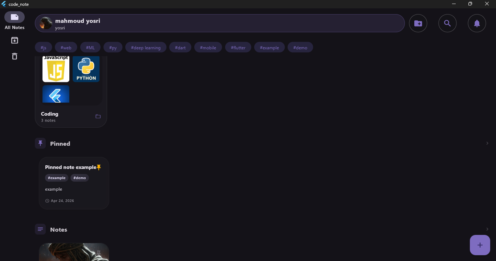
  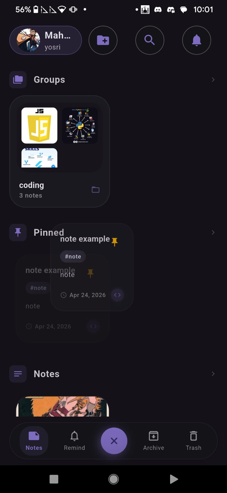
</p>

---

### 🔍 Search & Live Suggestions
Advanced search logic with real-time suggestions matching titles and tags.

<p align="center">
  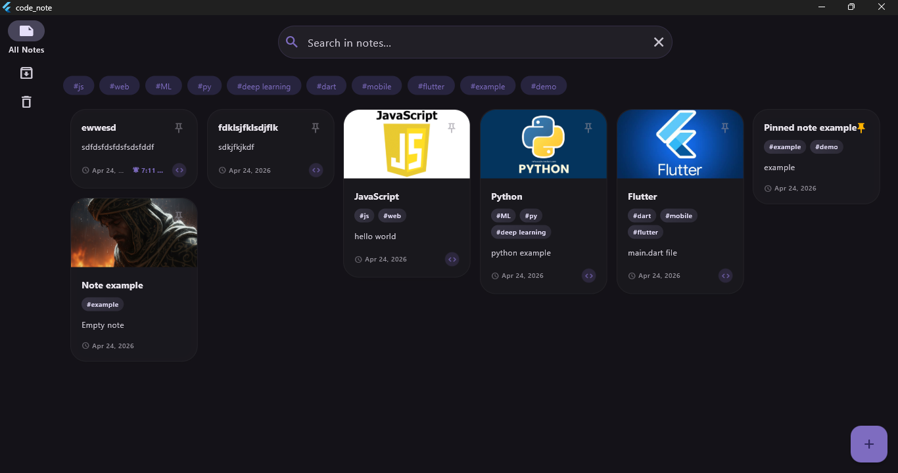
  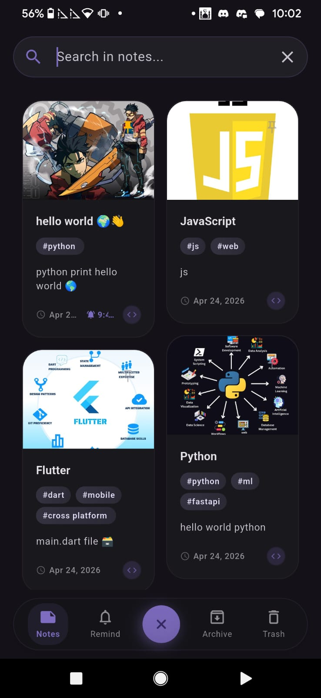
</p>

---

### 📝 Note Details & Multi-Block Editing
A rich editor supporting **Text**, **Code**, and **Image** blocks with syntax highlighting and tactile controls.

<p align="center">
  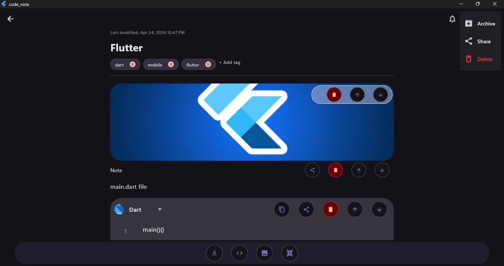
  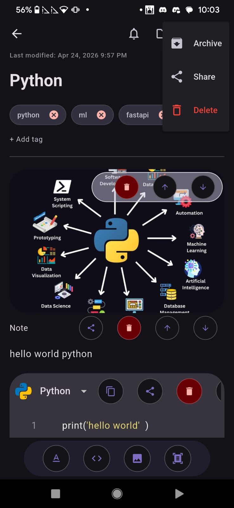
</p>

---

### 📁 Group Management
Organize related notes into functional groups with dedicated detail views.

<p align="center">
  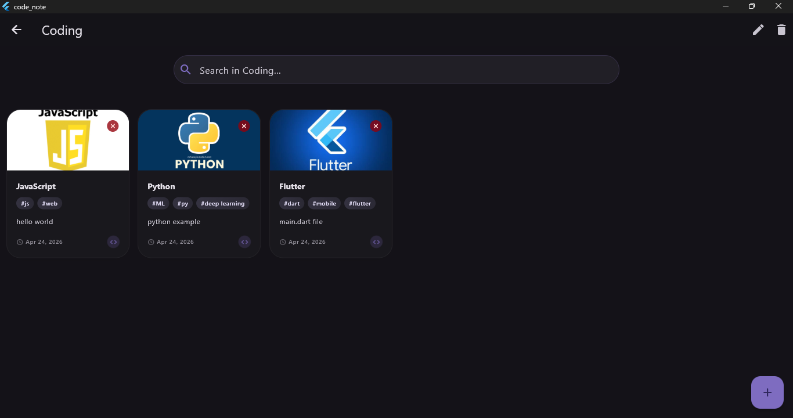
</p>

---

### ⚙️ User Settings & Personalization
Customize your experience with **Theme Mode** (Dark/Light/System) and adjustable **Font Sizes**.

<p align="center">
  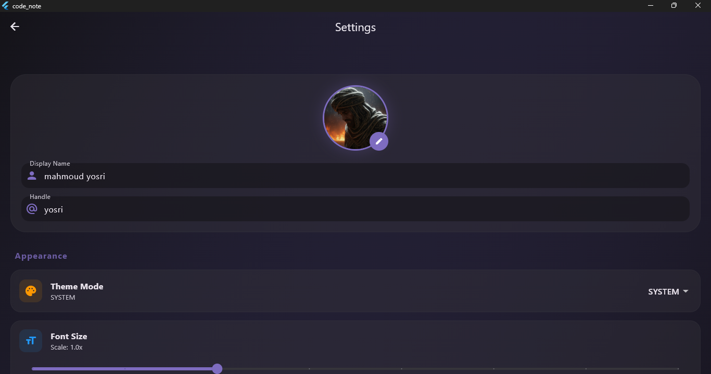
  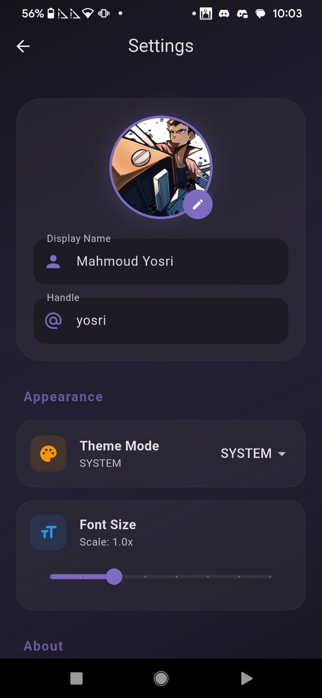
</p>

---

### 🔔 Reminders & Notifications
Never miss a task with the integrated reminder picker and notification shortcuts.

<p align="center">
  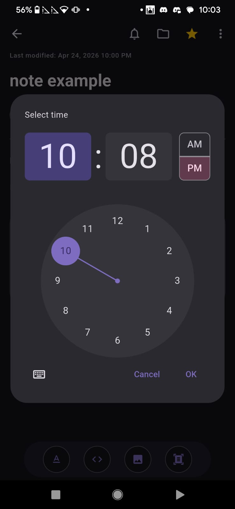
</p>

---

### 👆 Tactile Interactions
Smooth **Swipe-to-Action** (Archive/Delete) interactions optimized for both desktop and touch.

<p align="center">
  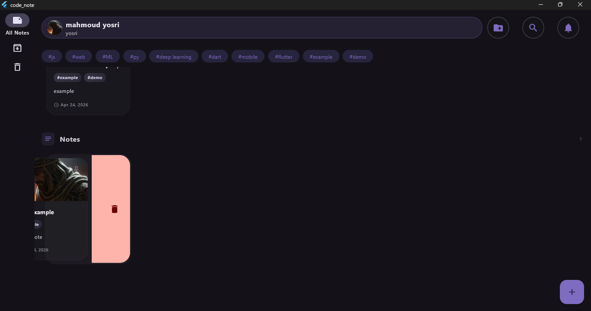
  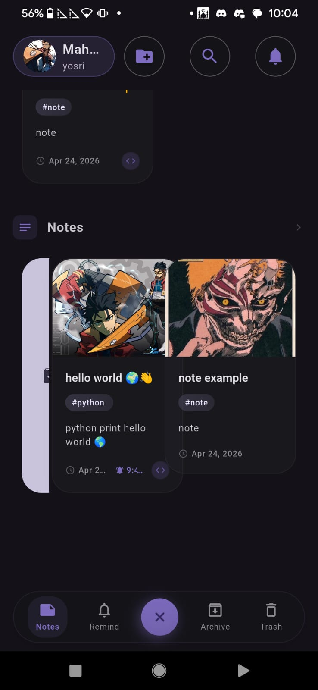
</p>

---

### 🔐 Authentication
Secure entry point to your local workspace.

<p align="center">
  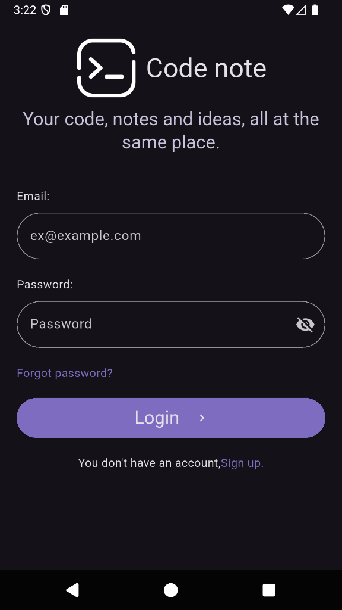
</p>

---

## 🚀 Massive Feature Update (April 2026)
We've recently overhauled CodeNote to move from a basic MVP to a production-ready power tool.

- **Advanced Search Hub**: Live suggestions, tag-based filtering, and multi-criteria queries.
- **Persistence 2.0**: The app now remembers your session state, last active tab, and intelligently bypasses onboarding for returning users.
- **Premium Tactile UI**: Added bouncy physics, haptic feedback, and optimized layouts for both Windows (Navigation Rail) and Mobile (NavBar).
- **Organization**: Robust Grouping system, Archive/Trash logic, and a Reminders engine.

---

## ✨ Implemented Features

<details>
<summary>🛠️ Architecture & Core</summary>

- **Clean Architecture**: Built following TDD principles with a strict separation of Domain, Data, and Presentation layers.
- **Local-First Persistence**: Fully offline-capable using `shared_preferences` for fast and reliable local storage across all platforms.
- **Auto-Save**: Every change you make—whether it's a title, a text block, or a code snippet—is saved instantly.
- **State Persistence**: Remembers your last active tab (Notes, Reminders, Archive, or Trash) so you can pick up exactly where you left off.
- **Optimized Onboarding**: Intelligent startup flow that skips the onboarding screen for returning users.
</details>

<details>
<summary>🔍 Advanced Search & Discovery</summary>

- **Live Search Suggestions**: Real-time matching for note titles and tags as you type.
- **Dynamic Tag Cloud**: A horizontal, interactive tag list on the home screen for instant filtering.
- **Multi-Criteria Search**: Find notes by title, tag content, or text within code/text blocks.
</details>

<details>
<summary>📝 Note Management (Keep-Inspired)</summary>

- **Pinning**: Keep your most important notes at the top of your dashboard.
- **Archiving**: Swipe to hide notes from your main view without deleting them.
- **Trash System**: A dedicated trash section for deleted notes with restore and permanent delete options.
- **Reminders**: Integrated scheduling and a quick-access notification bell for upcoming tasks.
</details>

<details>
<summary>💻 Developer Experience (Jupyter-Inspired)</summary>

- **Block-Based System**: Notes are composed of dynamic blocks:
  - **Text Blocks**: For rich descriptions and ideas.
  - **Code Blocks**: Multi-language support (Python, Dart, C++, etc.) with syntax-aware organization.
  - **Image Blocks**: Attach screenshots or diagrams directly to your notes.
- **Code Suggestions**: Language-aware autocomplete for faster code writing.
- **OCR (Document Scan)**: Extract text or code directly from images using specialized Google ML Kit text recognition.
</details>

<details>
<summary>📱 Premium UI/UX</summary>

- **Bouncy Animations**: Fluid, scale-bounce interactions on icons and buttons for a premium feel.
- **Haptic Feedback**: Tactile response on core actions (saving, switching tabs, clicking tags).
- **Responsive Layout**: 
  - **NavigationRail** for Desktop and Web.
  - **BottomNavigationBar** for Mobile.
  - **Adaptive Grid**: Dynamically scales columns based on device width.
</details>

---

## 🚀 Roadmap (Upcoming Features)

<details>
<summary>View Future Plans</summary>

- [ ] **Cloud Sync**: Optional cloud synchronization for multi-device workflows.
- [ ] **AI Snippet Explainer**: Integrated AI to explain complex code blocks or suggest optimizations.
- [ ] **Public Note Sharing**: Generate public links to share your technical notes with the community.
- [ ] **Advanced Formatting**: Markdown support within text blocks.
</details>

---

## 🛠️ Tech Stack
- **Framework**: [Flutter](https://flutter.dev)
- **State Management**: [Bloc](https://pub.dev/packages/flutter_bloc)
- **Dependency Injection**: [GetIt](https://pub.dev/packages/get_it)
- **Local Storage**: [Shared Preferences](https://pub.dev/packages/shared_preferences)
- **OCR**: [Google ML Kit Text Recognition](https://pub.dev/packages/google_mlkit_text_recognition)
- **Icons & UI**: Material 3 Design with Custom Bouncy Animations

---

## 🏗️ Getting Started

1. **Clone the repository**
2. **Install dependencies**:
   ```bash
   flutter pub get
   ```
3. **Run the app**:
   ```bash
   flutter run
   ```

---
Made with ❤️ for the developer community.
